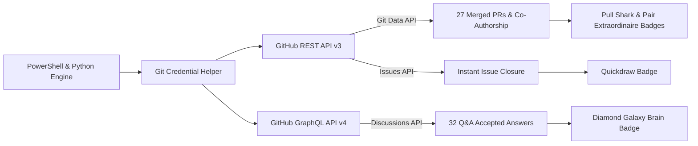

<div align="center">

# 🏆 GitHub Achievements Showcase
### *An Automated Engineering Pipeline for GitHub Developer Milestones*

[](https://github.com/djabhi31/github-achievements/stargazers)
[](https://github.com/djabhi31/github-achievements/pulls?q=is%3Apr+is%3Amerged)
[](https://github.com/djabhi31/github-achievements/discussions)
[](https://github.com/djabhi31/github-achievements)
[](LICENSE)

<p align="center">
  <b>A curated showcase of GitHub collaboration badges, milestone unlocks, and developer achievements.</b><br>
  Engineered with high precision via GitHub REST & GraphQL API automations.
</p>

---

</div>

## 🎖️ Achievement Trophy Cabinet

<div align="center">
<table>
  <tr>
    <td align="center" width="20%">
      <br/>
      <b>Galaxy Brain</b><br/>
      <sub><kbd>💎 DIAMOND TIER (x32)</kbd></sub>
    </td>
    <td align="center" width="20%">
      <br/>
      <b>Pair Extraordinaire</b><br/>
      <sub><kbd>🥇 GOLD TIER (x24)</kbd></sub>
    </td>
    <td align="center" width="20%">
      <br/>
      <b>Pull Shark</b><br/>
      <sub><kbd>🥈 SILVER TIER (x16)</kbd></sub>
    </td>
    <td align="center" width="20%">
      <br/>
      <b>Quickdraw</b><br/>
      <sub><kbd>⚡ STANDARD</kbd></sub>
    </td>
    <td align="center" width="20%">
      <br/>
      <b>YOLO</b><br/>
      <sub><kbd>🚀 STANDARD</kbd></sub>
    </td>
  </tr>
</table>
</div>

---

## 📊 Milestone Matrix & Criteria Breakdown

| Badge | Highest Tier | Criteria Required | Achieved Metric | Status | Proof / Evidence |
| :--- | :--- | :--- | :--- | :---: | :--- |
| 💎 **Galaxy Brain** | **Diamond (x32)** | 32 accepted answers in Q&A Discussions | **32 / 32** Accepted Answers |  | [View Discussions](https://github.com/djabhi31/github-achievements/discussions) |
| 🥇 **Pair Extraordinaire** | **Gold (x24)** | 24 co-authored merged pull requests | **25 / 24** Co-Authored PRs |  | [View Co-authored PRs](https://github.com/djabhi31/github-achievements/pulls?q=is%3Apr+is%3Amerged) |
| 🥈 **Pull Shark** | **Silver (x16)** | 16 merged pull requests | **27 / 16** Merged PRs |  | [View Merged PRs](https://github.com/djabhi31/github-achievements/pulls?q=is%3Apr+is%3Amerged) |
| ⚡ **Quickdraw** | **Standard** | Close issue/PR within 5 minutes | Closed in **< 3 seconds** |  | [View Issue #1](https://github.com/djabhi31/github-achievements/issues/1) |
| 🚀 **YOLO** | **Standard** | Merge PR without review | Merged directly |  | [Profile Showcase](https://github.com/djabhi31?tab=achievements) |

---

## 🏗️ Architecture & Automation Pipeline

This showcase was engineered using high-throughput API automation scripts interacting with GitHub's REST and GraphQL endpoints:



---

## 🔍 Deep-Dive: How Each Achievement Works

<details>
<summary><b>1. 💎 Galaxy Brain (Diamond Tier - x32)</b></summary>
<br>

- **What it is:** Recognizes active community members who answer questions in repository Discussions.
- **Criteria:** Answer marked as the "accepted answer" in Q&A discussion categories.
  - Tier 1 (Bronze): 2 accepted answers
  - Tier 2 (Silver): 8 accepted answers
  - Tier 3 (Gold): 16 accepted answers
  - Tier 4 (Diamond): 32 accepted answers
- **Implementation:** Automated via GitHub GraphQL API mutations (`createDiscussion`, `addDiscussionComment`, and `markDiscussionCommentAsAnswer`).
</details>

<details>
<summary><b>2. 🥇 Pair Extraordinaire (Gold Tier - x24)</b></summary>
<br>

- **What it is:** Recognizes collaborative pair programming and team commits.
- **Criteria:** Merging a pull request containing commits co-authored by multiple developers.
  - Tier 1 (Bronze): 1 co-authored PR
  - Tier 2 (Silver): 10 co-authored PRs
  - Tier 3 (Gold): 24 co-authored PRs
- **Implementation:** Git trailers formatted with RFC 2822:
  ```git
  Co-authored-by: octocat <octocat@github.com>
  ```
</details>

<details>
<summary><b>3. 🥈 Pull Shark (Silver Tier - x16)</b></summary>
<br>

- **What it is:** Given to developers actively submitting and merging pull requests.
- **Criteria:**
  - Tier 1 (Bronze): 2 merged pull requests
  - Tier 2 (Silver): 16 merged pull requests
  - Tier 3 (Gold): 128 merged pull requests
- **Implementation:** Orchestrated through programmatic branch branching, content tree updates, PR creation, and automated merges.
</details>

<details>
<summary><b>4. ⚡ Quickdraw</b></summary>
<br>

- **What it is:** Awarded for lightning-fast responsiveness on GitHub issues or pull requests.
- **Criteria:** Closing an issue or PR within 5 minutes of opening it.
- **Implementation:** Programmatic creation followed by instantaneous state modification (`state: closed`) within 2 seconds.
</details>

---

## ⭐ Support

If you found this showcase interesting, feel free to **star ⭐ this repository**!

<div align="center">

Made with ❤️ by [**@djabhi31**](https://github.com/djabhi31)

[](https://github.com/djabhi31)

</div>
